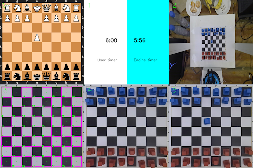

<p align="center">
  
</p>

--------------------------------------------------------------------

# GM Robot Arm

We are developing a robot arm system that is capable of playing chess. This is just a fun project meant to help us learn new thing.
Here is the simple action flow of the robot arm:
- Take a snapshot of the current chess-board layout using a top-down camera
- Deduce the previous made by the human by comparing the previous and current chessboard layouts using computer vision
- Choose the next best move using a chess engine
- Perform this move through autonomous control of the robot arm


Here is a [video demo](https://www.youtube.com/watch?v=iJfm-6d8eYs) showcasing our robot arm playing a full chess game (And winning).


## Installation

```bash
git clone https://github.com/Charbel199/gm-robot-arm
cd gm-robot-arm
pip install -r ./docker/requirements.txt # Will be later replaced with the actual docker container
```

### Azure Kinect Camera Setup
**Steps to use the azure kinect camera through docker**(_Note: Using the depth camera in docker requires OpenGL which we did not implement yet_)
1) Navigate to the AzureKinect directory
2) Run `. DockerBuild.bash`
3) Wait for the docker image to build 
4) Navigate back to the root of the repo
5) Run `. CameraRun.bash`
6) Using ROS, subscribe to the topic /rgb/image_raw for a BGRA format image 


## How to run it

Run each of the following commands in a separate terminal:
```bash
. CameraRun.bash
python3 ./cores/control_core.py
python3 main.py
```

There are some environment variables which can be set before running `main.py`:

- **USE_CAMERA**: this variable specifies if we want to use the camera or pre-existing images on the system (useful when the camera is not connected)
- **IS_SIMULATION**: this variable allows us to run the robot in simulation mode, where it simply follows a set of predetermined moves instead of evaluating the state of the board and playing the move deduced by the engine.
- **USE_ROBOT**: this variable allows us to run the system without actually using the robotic arm, which is valuable when testing other aspects of the system as the arm is time consuming.
- **WITH_SOUND**: allows the user to mute the clock sound if desired.
- **USE_PREVIOUS_CALIBRATED_BOARD**: this variable allows us to surpass the calibration phase in the case where we are playing in an environment where calibration has already taken place.
- **ENGINE_SIDE**: allows us to choose if the robot is playing as white or black.
- **ELO**: this variable determines what elo the engine will be using (valuable if the user is a beginner and would like to play against someone of the same skill)

To properly use the engine, the following sequence takes place in the gm core:

- Press ‘e’ to calibrate the board (this can be bypassed if the USE_PREVIOUS_CALIBRATED_BOARD environment variable is true). The gm core will then instruct the vision core to calibrate the board based on the current image. This must be done on an empty chess board.
- Press ‘i’ to take a snapshot of the initial board layout. This is important for the vision core to have a base image to start comparing to and figure out what moves were done. Make sure you have placed all the pieces before you press ‘i’.
- Start playing, and press ‘space’ when you complete your move.
  - The robot will make sure that it is the user's turn and that the previous steps (calibration and initialization) are complete.
  - It will launch the chess clock.
  - The gm core instructs the vision core to capture the current image.
  - It then instructs it to compare the previous board image to the current board image and determine which squares changed.
  - It then asks the chess core to determine which move was executed based on which squares changed.
  - It will update the virtual board state.
  - It then switches turn to the robots turn.
- Once it is the robots turn:
  - The gm core retrieves the best move from the chess core based on the current board state.
  - It then asks the chess core to dissect the best move into a sequence of moves that the control core can execute (PICKs, PLACEs, and YEETs)
  - The gm core then sets the control move counter based on how many control moves need to be completed for the entire move to be completed.
  - It then publishes all the moves on the topic that the control core is subscribed to.
  - The gm core waits until the move is fully executed (move counter is 0)
  - The gm core instructs the vision core to capture the current image.
  - It then instructs the chess core to update the virtual board.
  - Finally, it switches back to the user’s turn.

Some other features that can be done are pressing ‘v’ to visualize the last move as determined by vision and to press ‘b’ to visualize all images that the vision core is using. 

The final feature is the ‘esc’ key that allows us to reset the cores and start a game from scratch.

--------------------------------------------------------------------

## General architecture

The system is divided into **4 main components**: Chess core, vision core, control core and gm core. Each core has a set
of unique functionalities which we will discuss further in later parts.


Here is a communication diagram showing how the various components communicate with each other:


## Software Components

- Stockfish
- ROS
- OpenCV

## Hardware Components

- [6 DOF Robot arm (LeArm)](https://www.hiwonder.com/store/learn/2.html)
- Azure Kinect camera
- Arduino Mega 2560

_Note: The robotic arm used is intended for educational purposes, therefore, its servos are not the most accurate.
It would obviously have been better to use a more precise and expensive arm for better results._

_Note 2: The Azure kinect camera is way overkill for this project, but it was the camera we had at hand._

## Chess pieces

There chess pieces were designed on SOLIDWORK, here is a picture of the bishop 3d model:

<p align="center">
  
</p>


## Cores

### Chess Core

The chess core has two main functionalities:
- Visualize the current board layout
- Load a chess engine to generate moves for the robotic arm

Our chess visualizer makes use of the python **“chess”** package which 
provides us with a miniature **chess board svg** and can be fed moves 
to update the svg. We are using the resulting image to track the piece positions during the game.

<p align="center">
  
</p>


### Vision Core

The main tasks of the vision core are to analyze the physical chess board, deduce the player’s move, and keep the chess pieces’ positions up to date.
We will briefly discuss the main functions that were implemented in the vision core:

- Preprocess image: This function is called each time we capture a new image. Based on the 4 markers in the corners of the chess board, it determines their coordinates and warps the image so that the chessboard is the only part of the image that is left.

<p align="center">
  
</p>

- Visualize all images: Show up to the last 7 chess board snapshots (each representing a move) along with the calibrated board image.
- Visualize last move: Visualize the last 2 chess board snapshots with the move performed highlighted in red
- Calibrate: Uses the HSV threshold specified in the config json file located in the “assets/hsv” folder, the Vision core obtains the squares information after some image processing:
  - Get HSV filtered canny edges for white squares
  - Get HSV filtered canny edges for black squares
  - Combine both edge images
  <p align="center">
    
  </p>
  
  - Perform Gaussian blur and threshold

  <p align="center">
    
  </p>

  - Find all possible contours and filter them based on the board size (We are assuming that each square has a minimum area of: (Wboard * Hboard / 64) and a maximum area of: minimum area * 1.3)

  <p align="center">
    
  </p>

  - Reduce points meaning that since each square has 4 corners, many points will overlap, this step combines points that are very close to each other


- Capture image: Record the current image from the camera (Recorded through ROS in GM core
- Update images: Update the list of image (Keep the 7 most recent snapshots)
- Capture initial chess board layout: Set the next recorded image as the “Initial board layout” snapshot
- Get user squares changed: To deduce which squares have changed between the last 2 recorded snapshots, the vision core extracts color features from each square of both images and compares them, based on this comparison it can accurately determine which squares have changed. To explain this concept further: It is very inefficient to try to determine the type of piece that is present on each square on the board, alternatively, we are determining the DIFFERENCE between every 2 snapshots, and since we have a constant record of the pieces’ locations on the chess board, the system is able to deduce the next position on the chess board. (This is similar to how GITHUB works where each ‘delta’/difference is recorded with each commit and we are able to rollback to any previous version by simply reversing commits)
<p align="center">
  
</p>
Here is a screenshot showing the visualization generated by the vision core module:
<p align="center">
  
</p>


### Control Core

The control core is mainly responsible for controlling the robotic arm. This core receives the move it's supposed to make on a rostopic in a custom message type called Move. This message contains two variables: type and square. The possible types are:

- PICK: specifies that we want the arm to pick the piece in the square.
- PLACE: specifies that we want the arm to place the piece it is carrying in the square.
- YEET: specifies that we want the arm to discard the piece it is carrying (used for taking a piece).

The square is simply a chess board square specified as ‘letterNumber’ such as ‘a5’.

The control core then accesses a python dictionary containing the sequence of moves that must be taken to go to a specific square. This dictionary has chess squares as its keys and a list of servo positions as its values. 

The core then publishes these servo positions onto a rostopic as a custom message type called ServoPositions. These positions are then written to the servos by arduino. The exact communication will be discussed in a later section. 

Let us take a full example of how the control core functions:

Consider that the chess core determines that the best move is for the pawn on square e5 to take the pawn on d4, the Move messages published by the gm core would be:

1) PICK D4
2) YEET 
3) PICK E5
4) PLACE D4

The control core would thus start with the message: [‘PICK’, ‘d4’]. It would access the move dictionary to know the servo positions corresponding to d4, and start publishing these positions to the arduino for the robot arm to move to d4. The type ‘PICK’ helps us determine that the gripper should be open initially, and should close once we are in the position d4. At the end of this move, we expect the arm to now have the pawn at d4 in its gripper.

Afterwards, the control core proceeds with the message [‘YEET’,’’]. This means that the arm will now simply go to the predetermined YEET_POSE and release the pawn it is carrying there.

Then, the control core processes the message [‘PICK’, ‘e5’]. Thus, the robotic arm is expected to go to square e5 and pick up the pawn there.

Finally, the control core proceeds with the last message [‘PLACE’, ‘d4’] in which it will place the pawn it is currently carrying on square d4, meaning the entire move is completed. At this point, the robotic arm will return to its SAFE_POSE which is a position that is away from the board and doesn’t impede the camera's field of view.

_Note that the arduino is publishing constantly to a topic to inform the control core it is done with the positions that were last sent to it, this allows the control core to send the other move. Additionally, the control core decrements a global parameter everytime a move is completed which helps the gm core determine if the entire move has been completed. In the previous example, this counter would be 4, and the control core will decrement it after every sequence, and once all 4 have been completed the gm core knows that the entire move is executed and can thus proceed._


### GM Core

The GM core, or the grandmaster core, is the “brain” of the robot. Its main function is to create and connect the other 3 cores and transmit messages between them.  It also creates the menu to be used by the user and takes his inputs through a keylogger. 

All the functionalities of the GM core were discussed in the [How to run it](#how-to-run-it) section where the environment variables and keyboard inputs were discussed. 

## Developers

- [Charbel Bou Maroun](https://github.com/Charbel199)
- [Georges Daou](https://github.com/George1044)
- [Ralph Sakhat](https://github.com/Ralph-S)

## License
This project is licensed under the MIT License. See the LICENSE file for details.


## Acknowledgements

We would like to thank [3D Maker shop](https://www.3dmakershop.com/) for sponsoring our project and helping us print all the chess pieces that we used.

